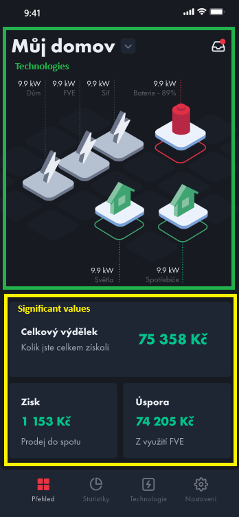

# Dashboard

- **Route:** `{server}/api/Dashboard`

### `Get` Dashboard

- **Endpoint:** `GET /`
- **Description:** Endpoint to obtain dashboard data.
- **Parameters:**

  - `nodeId`: Node from tree.
  - `orgId`: Current organization ID.

- **Response:**

  - `200 OK`: Dashboard data for initial page.
  - 2 objects

  

  - **significant values**:
    - collection
    - for boxes with values
    - Grouped to types
    - "values/size": 1 for small box, 2 for wide box
  - **technologies**
    - used for graphics in the upper half

  ```json
  {
    // Values for lower part of the dashboard screen
    "significantValues": [
      {
        "name": "string",
        "description": "string",
        "technology": 0,
        "order": 0, //Order or the box with data on the dashboard
        "values": [
          {
            "id": 0,
            "name": "string",
            "desctription": "string",
            "value": "string",
            "unit": "string",
            "size": 0, //Size of block in the app, 1 for small box, 2 for wide box
            "dateTime": "2024-04-08T01:00:53.095Z"
          }
        ]
      }
    ],
    // Values for upper part of the dashboard screen
    "technologies": [
      {
        "name": "string",
        "id": 0,
        "technologyId": 0,
        "technologyName": "string",
        "typeId": 0, //Deprecated = TechnologyId
        "typeName": "string", //Deprecated = TechnologyName
        "description": "string",
        "unitCategory": 0,
        "unit": "string",
        "value": "string",
        "lastInsert": "2024-04-08T01:00:53.095Z",
        "timerSeconds": 0,
        "modelRepositoryVariable": 0,
        "range": {
          "from": 0,
          "to": 0
        }
      }
    ]
  }
  ```

  - `401 Unauthorized`: User not authorized to perform this action.
