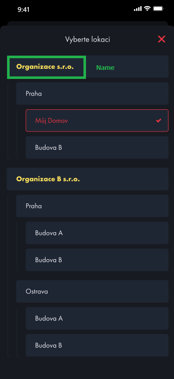

# Organizations

- Endpoint for obtainting user organization list
- _/api/Organization/Organizations_

## Response

```Json
[
  {
    "id": 0,
    "name": "string"
  }
]
```

# Tree

- Endpoint for obtainting users tree
- _/api/Organization/Tree_

- **parameters**:
  - _orgId:_ Current organization ID

## Response

```Json
[
  {
    "name": "string",
    "id": 0,
    "parentId": 0,
    "typeID": 0,
    "deviceTypeID": 0,
    "organizationID": 0,
    "childrenCount": 0,
    "order": 0,
    "modelRepositoryDevice": 0,
    "deviceTypeName": "string",
    "typeName": "string",
    "children": [
      "string"
    ]
  }
]
```



# TreeNodeTypes

- Endpoint for obtainting all possible node types in tree
- _/api/Organization/TreeNodeTypes_

## Response

```Json
[
  {
    "id": 0,
    "name": "string",
    "description": "string",
    "iconUrl": "string",
    "iconLastUpdate": "2024-04-03T09:38:21.840Z"
  }
]
```
