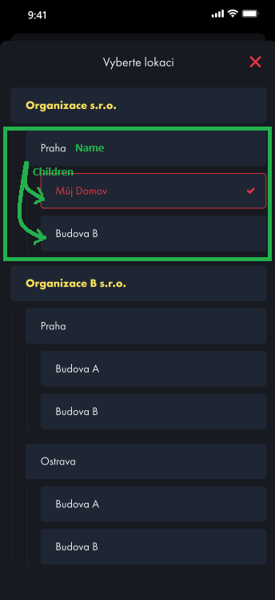

# Organizations

- **Route:** `{server}/api/Organizations`

## `Get` Get Organizations

- **Endpoint:** `GET /Organizations`
- **Description:** Endpoint to obtain the list of organizations associated with the user.
- **Parameters:** None
- **Response:**
  - `200 OK`: User organizations retrieved successfully.
    ```json
    [
      {
        "id": 0,
        "name": "string"
      }
    ]
    ```
    
  - `401 Unauthorized`: User not authorized to perform this action.

## `Get` Tree

- **Endpoint:** `GET /Tree`
- **Description:** Endpoint to obtain the tree structure of users.
- **Parameters:**
  - `orgId`: The ID of the organization to retrieve the tree structure for.
- **Response:**
  - `200 OK`: User tree retrieved successfully.
    ```Json
    [
      {
        "name": "string",
        "id": 0,
        "parentId": 0,
        "typeID": 0,
        "deviceTypeID": 0,
        "organizationID": 0,
        "childrenCount": 0,
        "order": 0,
        "modelRepositoryDevice": 0,
        "deviceTypeName": "string",
        "typeName": "string",
        "children": [
          "string"
        ]
      }
    ]
    ```
    
  - `401 Unauthorized`: User not authorized to perform this action.

## `Get` Get Tree Node Types

- **Endpoint:** `GET /TreeNodeTypes`
- **Description:** Endpoint to obtain all possible node types in the tree.
- **Parameters:** None
- **Response:**
  - `200 OK`: Node types retrieved successfully.
    ```Json
    [
      {
        "id": 0,
        "name": "string",
        "description": "string",
        "iconUrl": "string",
        "iconLastUpdate": "2024-04-03T09:38:21.840Z"
      }
    ]
    ```
  - `401 Unauthorized`: User not authorized to perform this action.
