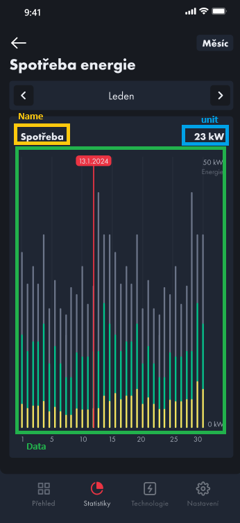
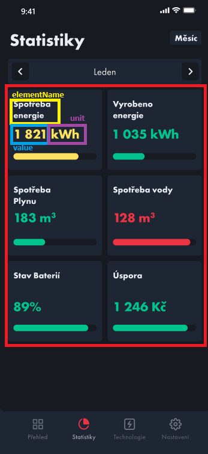

# Settings

- **Route:** `{server}/api/Stats`

## `Get` Get Timeseries Data

- **Endpoint:** `GET /TimeseriesData`
- **Description:** Endpoint returning Timeseries for Graphs. Use custom time to specify your datetime values.
- **Parameters:**
  - `Preset`: Use ID from `api/Stats/PossibleTimeseriesTimes`. To use `From` and `To` times, set this to -1.
  - `From`: Start DateTime.
  - `To`: End DateTime.
  - `variables`: Collection of requested variables. (`elementId` from `/AggregationDataForNode`)
  - `nodeId`: The ID of the node, use same node Id which was used for input to previous call `/AggregationDataForNode`
- **Response:**
  - `200 OK`: Timeseries data.
    ```json
    [
      {
        "name": "string",
        "unit": "string",
        "aggregationName": "string",
        "variableId": 0,
        "data": [
          {
            "timestamp": "2024-04-07T19:34:11.083Z",
            "value": 0
          }
        ]
      }
    ]
    ```
    
  - `401 Unauthorized`: User not authorized to perform this action.

## `Get` Get Aggregation Data for Node

- **Endpoint:** `GET /AggregationDataForNode`
- **Description:** Endpoint to retrieve aggregated data for a specific node, using custom time values.
- **Parameters:**
  - `time`: Custom time values for aggregation.
    - `Preset`: Use ID from `api/Stats/PossibleTimeseriesTimes`. To use `From` and `To` times, set this to -1.
    - `From`: Start DateTime.
    - `To`: End DateTime.
  - `nodeId`: The ID of the node for which data is requested.
- **Response:**
  - `200 OK`: Aggregated data retrieved successfully.
    ```json
    [
      {
        "aggregationId": 0,
        "aggregationName": "string",
        "aggregationDescription": "string",
        "aggregationTypeId": 0,
        "first": {
          "value": "string",
          "abbr": "string",
          "description": "string"
        },
        "second": {
          "value": "string",
          "abbr": "string",
          "description": "string"
        },
        "order": 0,
        "elementId": 0, //Id of variable => used for GET /TimeseriesData
        "elementName": "string",
        "variableId": 0,
        "valueSerialized": "string",
        "unit": "string",
        "value": 0,
        "readDateTime": "2024-04-07T19:35:48.642Z"
      }
    ]
    ```
    
  - `401 Unauthorized`: User not authorized to perform this action.

## `Get` Possible Timeseries Times

- **Endpoint:** `GET /PossibleTimeseriesTimes`
- **Description:** Endpoint to retrieve all presets for timeseries graphs.
- **Parameters:** None
- **Response:**
  - `200 OK`: Preset timeseries times retrieved successfully.
    ```json
    [
      {
        "name": "string",
        "id": 0,
        "defaultInterval": {
          "name": "string",
          "intervalsCount": 0,
          "order": 0,
          "id": 0,
          "maxRangeInHours": 0,
          "defaultRangeInHours": 0
        },
        //now unused
        "possibleIntervals": [
          {
            "name": "string",
            "intervalsCount": 0,
            "order": 0,
            "id": 0,
            "maxRangeInHours": 0,
            "defaultRangeInHours": 0
          }
        ]
      }
    ]
    ```
