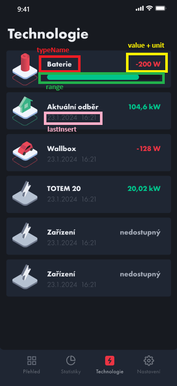

# Technology

- **Route:** `{server}/api/Technology`

## `Get` Technology Details

- **Endpoint:** `GET /Detail`
- **Description:** Endpoint to retrieve technology details for a specific technology.
- **Parameters:**
  - `orgId`: The ID of the organization.
  - `nodeId`: The ID of the node.
  - `technologyId`: The ID of the technology.
  - `Preset`: Use ID from `api/Stats/PossibleTimeseriesTimes`. To use `From` and `To` times, set this to -1.
  - `From`: Start DateTime.
  - `To`: End DateTime.
- **Response:**
  - `200 OK`: Technology details retrieved successfully.
    ```json
    {
      "id": 0,
      "name": "string",
      "description": "string",
      "data": [
        {
          "id": 0, // technology ID
          "name": "string", // technology Name
          "unitCategory": 0,
          "unit": "string",
          "value": "string",
          "lastInsert": "2024-04-07T20:36:20.077Z",
          "significant": true, //device may have multiple significant values
          "primary": true, //unique, only one variable per device
          "timerSeconds": 0, //refresh period
          "deviceName": "string",
          "modelRepositoryVariable": 0,
          "range": {
            "from": 0,
            "to": 0
          }
        }
      ],
      "timeseries": {
        "name": "string",
        "unit": "string",
        "aggregationName": "string",
        "variableId": 0,
        "data": [
          {
            "timestamp": "2024-04-07T20:36:20.077Z",
            "value": 0
          }
        ]
      },
      "devices": [
        {
          "description": "string",
          "id": 0,
          "name": "string",
          "technologyId": 0,
          "technologyName": "string",
          "typeId": 0, //Deprecated = TechnologyId
          "typeName": "string" //Deprecated = TechnologyName
        }
      ]
    }
    ```
    
  - `401 Unauthorized`: User not authorized to perform this action.

## `Get` Technologies for Node

- **Endpoint:** `GET /TechnologiesForNode`
- **Description:** Endpoint to retrieve all technologies in children nodes.
- **Parameters:**
  - `orgId`: The ID of the organization.
  - `nodeId`: The ID of the node.
- **Response:**
  - `200 OK`: Technologies for node retrieved successfully.
    ```json
    [
      {
        "description": "string",
        "id": 0,
        "name": "string",
        "unitCategory": 0,
        "unit": "string",
        "value": "string",
        "lastInsert": "2024-04-07T23:38:22.235Z",
        "timerSeconds": 0, //refresh period
        "range": {
          "from": 0,
          "to": 0
        }
      }
    ]
    ```
    
  - `401 Unauthorized`: User not authorized to perform this action.

## `Get` Technologies List

- **Endpoint:** `GET /List`
- **Description:** Endpoint to retrieve all possible technologies.
- **Parameters:** None
- **Response:**
  - `200 OK`: List of technologies retrieved successfully.
    ```json
    [
      {
        "Id": 0,
        "Name": "string",
        "Description": "string",
        "IconUrl": "string",
        "IconLastUpdate": "string"
      }
    ]
    ```
  - `401 Unauthorized`: User not authorized to perform this action.
