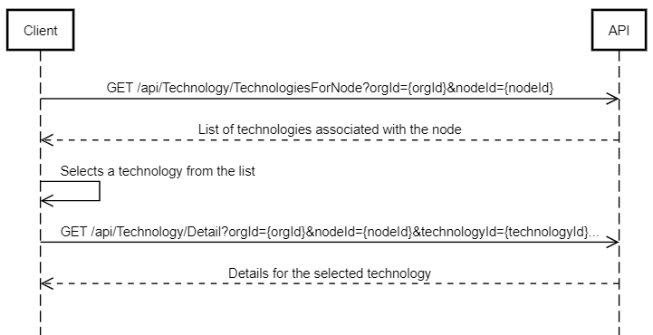

# Use Cases

## **Use Case 1**: Retrieve Tree Structure for Organization

- `Description`: This use case describes the process of retrieving the tree structure of users for a specific organization.

- `Preconditions`:

  - Client has access to the Organization API.

- `Flow`:

  1. Client sends a GET request to the Organization API endpoint `/api/Organization/Organizations`Organizations to retrieve a list of organizations.
  1. Organization API responds with a list of organizations including their IDs and names.
  1. Client selects the organization and extracts its ID.
  1. Client sends a GET request to the Organization API endpoint `/api/Organization/Tree` with the selected organization's ID as a parameter.
  1. Organization API responds with the tree structure of users for the specified organization.
     Client receives the tree structure of users.

  ## Sequence

  

## **Use Case 2**: Retrieve Timeseries Data for Aggregated Node

- `Description`: This use case describes the process of retrieving timeseries data for a node after retrieving aggregated data.

- `Preconditions`:

  - Client has access to the API.
  - Client has input values for `/api/AggregationDataForNode`
  - Aggregated data for the specified node is available.

- `Flow`:

  1. Client sends a GET request to the Aggregation API endpoint `/api/AggregationDataForNode` with the nodeId parameter to retrieve aggregated data for the specified node.
  1. Aggregation API responds with the aggregated data for the specified node, including the **elementId**.
  1. Client extracts the **elementId** from the response.
  1. Client sends a GET request to the Timeseries API endpoint `/api/TimeseriesData` with the **elementId** from previous response as input to array **variables**, **time**, and **nodeId** parameters to retrieve timeseries data.
  1. Timeseries API responds with the timeseries data for the specified node.
  1. Client receives the timeseries data.

  ## Sequence

  

## **Use Case 3**: Retrieve Technology Details

- `Description`: This use case describes the process of retrieving technology details for a specific technology after obtaining the list of technologies associated with a node.

- `Preconditions`:

- Client has access to the Technologies API.
- List of technologies associated with the node is available.

- `Flow`:

  1. Client sends a GET request to the Technologies API endpoint `/api/Technology/TechnologiesForNode` with the orgId, nodeId, and technologyId (optional) parameters to retrieve technologies associated with the specified node.
  1. Technologies API responds with a list of technologies associated with the node.
  1. Client selects a technology from the list.
  1. Client sends a GET request to the Technologies API endpoint `/api/Technology/Detail` with the orgId, nodeId, technologyId, and time (optional) parameters to retrieve details for the selected technology.
  1. Technologies API responds with the details for the selected technology.
  1. Client receives the details for the selected technology.

- `Extensions`:

  - If the list of technologies associated with the node is empty, the process ends with no further action.

  ## Sequence

  

## **Use Case 4**: Retrieve Technology Details and Device Dashboard Data

- `Description`: This use case describes the process of retrieving technology details for a specific technology and then obtaining dashboard data for a selected device associated with that technology.

- `Preconditions`:

  - Client has access to the API.
  - List of technologies associated with the node is available.
  - Details for a selected technology are available.

- `Flow`:

1. Client performs the steps outlined in the **\*Use Case 3**: Retrieve Technology Details\* use case to obtain details for a selected technology.
1. Client selects a device from the list of devices associated with the selected technology.
1. Client sends a GET request to the Devices API endpoint `/api/Device/DeviceDashboard/{deviceId}` with the deviceId parameter to retrieve dashboard data for the selected device.
1. Devices API responds with the dashboard data for the selected device.
1. Client receives the dashboard data for the selected device.

## Sequence

